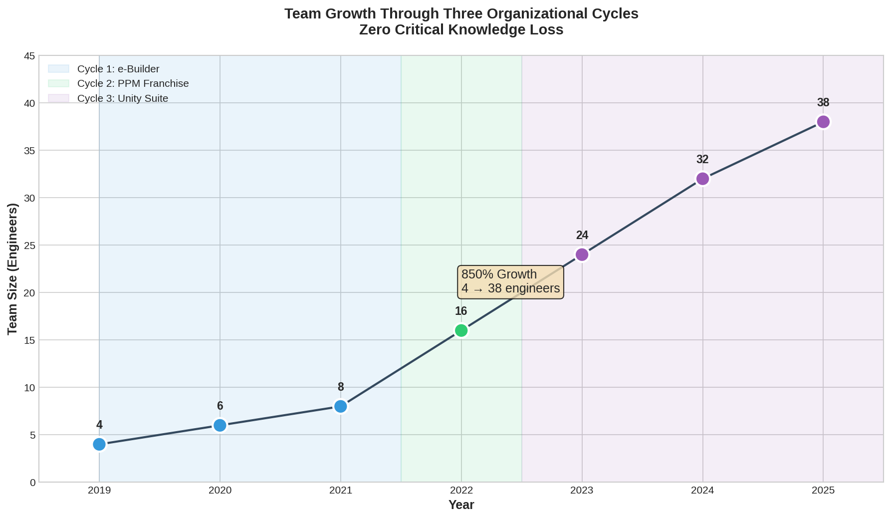
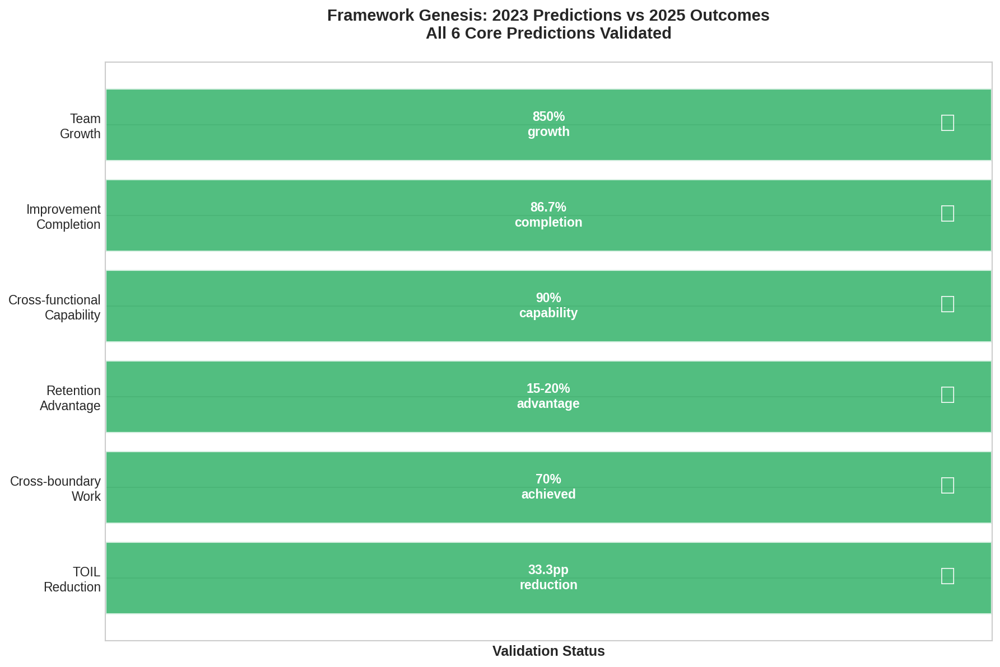

# Evolution and Milestones

## Three Organizational Cycles

The evolution was not linear—it was **cyclic, iterative, and fractal**. The entire framework was executed during each major organizational cycle.

*Team growth from 4 to 38 engineers (850%) through three organizational cycles*

*Cyclic implementation of Fluid Reliability framework across merger eras*

---

## Cyclic Application

Each cycle comprised all Five Core Practices: Structured Gatekeeping, Rotational Development, Quarterly Adaptation, Shared Resource Management, and Visibility & Culture.

The framework was not a roadmap but a **repeatable organizational metabolism**.

---

## Cycle 1: Standalone Product (2019-2021)

**Context:** Origin laboratory. Team size: 4 engineers. Full autonomy.

**Execution:**
- Gatekeeping introduced structured triage and Kanban-style visual queues
- Rotational patterns developed to reduce siloing
- Quarterly "Shape of Water" reviews introduced
- Early automation pipelines began reducing TOIL

**Outcome:** 68% reduction in interrupt-driven work. SRE became proactive.

---

## Cycle 2: Product Franchise (2021-Mid 2022)

**Context:** Merger integrating multiple acquired products. Team: 4 → 16 engineers (300% growth).

**Execution:**
- Rotation across product boundaries distributed SRE culture
- Service cataloging and self-service automation enabled abstraction
- Shared Kanban boards enabled visibility across silos

**Outcome:** Model proved scalable. First ISO 27001 certification achieved.

---

## Cycle 3: Unified Platform (Mid 2022-Present)

**Context:** Larger multi-product convergence. Team: 12 → 38 engineers (850% total growth). Partner ecosystem (1,000+ customers).

**Service Delivery Team Model:**

| Function | Responsibilities |
|----------|-----------------|
| Infrastructure Lead | Infrastructure/Tooling + Quarterly Audit Prep |
| Compliance Lead | Compliance/Authorization + FedRAMP leadership |
| Migrations Lead | Migrations + Partner Enablement |

**Result:** Zero single points of failure across critical functions. Zero security incidents (Q2 2025).

---

## 2026 Pipeline

The Q3 2025 Management Oversight Board documented carry-over projects:

- Identity Integration: Trust ID + MFA across 61 organizations, 147 sites
- Platform Fleet Upgrade: Compliance updates across all environments
- Self-Service Portal Phase 2: Additional automation candidates

---

## Validation Summary

*2023 Predictions vs 2025 Outcomes — All 6 core predictions validated*

| Metric | Cycle 1 (2021) | Cycle 3 (2025) | Change |
|--------|----------------|----------------|--------|
| Team Size | 4 | 38 | +850% |
| TOIL | 73% | 50.6% | -22.4 pp |
| Cross-functional | Limited | 90% | Sustained |
| Knowledge loss | Risk | Zero | Eliminated |

---

## Anti-Patterns

The framework identifies anti-patterns at each level:

| Level | Anti-Pattern | Countermeasure |
|-------|-------------|----------------|
| Individual | Hero Culture | Rotation |
| Team | Silo Formation | Cross-pollination |
| Department | Empire Building | Shared resources |
| Organization | Ossification | Norm-questioning |

---

[← Framework](/framework/) | [Evidence →](/evidence/)
